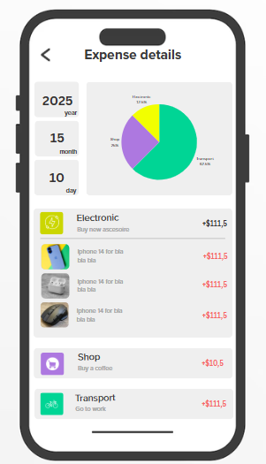

### Expensy

A new Flutter project.
Expensy is a mobile app built with Flutter that helps users track and manage their daily expenses. It allows users to add, categorize, and visualize their spending with charts and summaries. With a clean UI and support for themes, Expensy makes personal budgeting simple and efficient — whether you're managing monthly bills, shopping costs, or business expenses.

## Getting Started

    
    
    
    
    
    
    
    
    

This project is a starting point for a Flutter application.
## Download

A few resources to get you started if this is your first Flutter project:
SIM manager can be downloaded from the links below:

- [Lab: Write your first Flutter app](https://docs.flutter.dev/get-started/codelab)
- [Cookbook: Useful Flutter samples](https://docs.flutter.dev/cookbook)
<table>
    <thead>
        <tr>
            <th>OS</th>
            <th>Distribution</th>
            <th>Installation Guide</th>
            <th>CPU/Architecture</th>
            <th>Download Link</th>
        </tr>
    </thead>
    <tbody>
        <tr>
            <td>Android</td>
          <td>Play Store</td>
            <td></td>
            <td></td>
            <td><a href="https://play.google.com/store/apps/details?id=com.houssamelatmani.simmanager">Link</a></td>
        </tr>
    </tbody>
</table>

For help getting started with Flutter development, view the
[online documentation](https://docs.flutter.dev/), which offers tutorials,
samples, guidance on mobile development, and a full API reference.
### Features

__Smart Expense Tracking__: Easily record your daily expenses with categories, notes, and timestamps to stay organized.

__Interactive Charts__: Visualize your spending habits with clean, interactive pie and bar charts for better financial insight.

__Monthly Budget Goals__: Set custom budget limits and receive alerts when you're close to overspending.

__Dark & Light Theme Support__: Enjoy a smooth experience with both light and dark modes that adapt to your preferences.

### Getting Started

This project serves as a foundational template for Flutter applications. Whether you are a beginner or an experienced developer, you can use this project to jumpstart your Flutter development journey.

### Resources
To help you get started, here are some useful resources:

__Lab__: Write your first Flutter app: A guided introduction to Flutter development.
__Cookbook__: Useful Flutter samples: A collection of practical Flutter examples for various scenarios.
For more in-depth assistance with Flutter development, you can refer to the online documentation, which offers tutorials, samples, and comprehensive guidance on mobile development.

### Contributing
Contributions to this project are welcome! If you have suggestions for improvements or additional features, feel free to open an issue or submit a pull request.